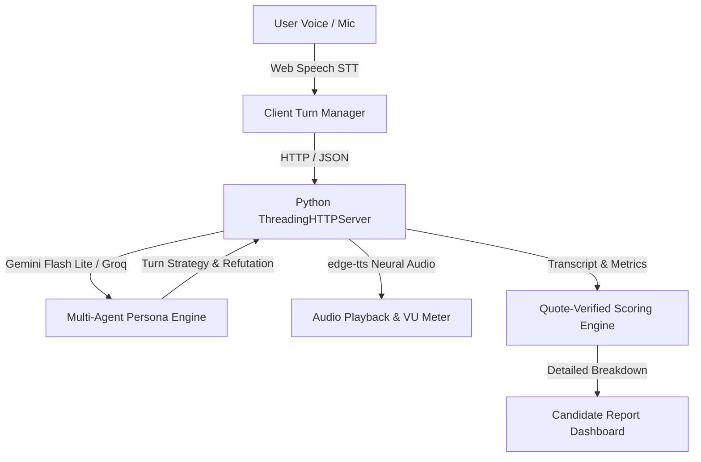

<div align="center">

## ⚡ GD ARENA ⚡
### *The Ultimate Voice-First AI Placement Simulator*
> **"Walk into your next Group Discussion & Tech Interview already feared and ready."**

[](https://github.com/kartikey-bhadauria/gd-arena/stargazers)
[](https://github.com/kartikey-bhadauria/gd-arena/network)
[](LICENSE)
[](https://gd-arena-phi.vercel.app)
[](https://github.com/kartikey-bhadauria/gd-arena/graphs/contributors)

[Features](#-features) • [Architecture](#️-architecture) • [Quick Start](#-quick-start) • [Personas](#-meet-the-ai-cast) • [Scoring Engine](#-how-scoring-works)

</div>

---

## 🔥 What is GD Arena?

**GD Arena** is an elite, zero-cost, voice-first AI simulation platform built for engineering students and high-performers to master campus placement Group Discussions (GD) and 1-on-1 technical mock interviews. 

Featuring realistic multi-agent AI personas with dynamic interruptions, real-time voice barge-in, STT/TTS neural synthesis, and quote-verified placement scoring — **GD Arena replicates real placement cell pressure with absolute precision.**

---

## 🚀 Key Features

- 🎙️ **Live Voice Barge-In & Neural Audio**: Real-time voice interaction with Web Speech API and `edge-tts` neural voice synthesis.
- 🤖 **Multi-Agent AI Opponents**: Dynamic discussion rooms where AI personas argue, interrupt, refute fallacies, and synthesize points.
- 📊 **Quote-Verified Placement Scoring**: No vanity scores. Every score card cites exact timestamped quotes from the transcript and provides actionable counter-arguments.
- 📄 **Resume Intelligence**: Parses your resume (`.pdf`, `.docx`, `.txt`) to tailor interview grilling questions dynamically.
- ⚡ **Primefold Design System**: Sleek, high-performance UI built with Tailwind CSS, Lucide icons, and immersive dark/light aesthetics.

---

## 👥 Meet the AI Cast

| Persona | Role | Personality & Style |
| :--- | :--- | :--- |
| **Mr. Verma** | Moderator | Strict placement cell head; keeps order, calls out tangents, tests assertiveness. |
| **Aarav** | The Dominator | Aggressive, fast-speaker; jumps in early, cuts off weak arguments, tests rebuttal skills. |
| **Priya** | Data-Driven | Relies on benchmarks, scalability metrics, and ROI figures; destroys hand-wavy claims. |
| **Rohan** | Synthesizer | Diplomatic mediator; bridges competing viewpoints and structures chaotic consensus. |
| **Neha** | Quiet Thinker | Delivers high-impact, late-stage analytical insights that shift room momentum. |
| **Ms. Kapoor** | Tech Interviewer | 1-on-1 interviewer for FAANG-level system design and deep algorithmic grilling. |

---

## 🏗️ Architecture



---

## 🛠️ Quick Start

```bash
# 1. Clone the repository
git clone https://github.com/kartikey-bhadauria/gd-arena.git
cd gd-arena

# 2. Install dependencies
pip install -r requirements.txt

# 3. Configure environment variables
cp .env.example .env
# Add your GOOGLE_API_KEY / GEMINI_API_KEY in .env

# 4. Launch the simulator
python server.py
# Open http://localhost:8000 in your browser
```

---


## 👥 Core Contributors & Team

| Contributor | Role & Responsibilities | GitHub |
| :--- | :--- | :--- |
| **Kartikey Bhadauria** | Creator & Lead Full-Stack Architect | [@kartikey-bhadauria](https://github.com/kartikey-bhadauria) |
| **Priyanshu Pandey** | Lead UI/UX Designer (Primefold System) | *Designer* |
| **Anshuman Maurya** | Senior Frontend Developer & Interaction Engineer | *Frontend Developer* |

---

## 🤝 Contributing

Contributions, feature requests, and bug reports are welcome! 
1. Fork the repo (`https://github.com/kartikey-bhadauria/gd-arena/fork`)
2. Create your feature branch (`git checkout -b feature/amazing-feature`)
3. Commit your changes (`git commit -m 'feat: add amazing feature'`)
4. Push to the branch (`git push origin feature/amazing-feature`)
5. Open a Pull Request

---

## 🛡️ License

Distributed under the **MIT License**. See `LICENSE` for more information.

<div align="center">
  <sub align="center">Built with ⚡ by Kartikey Bhadauria & Contributors</sub>
</div>
